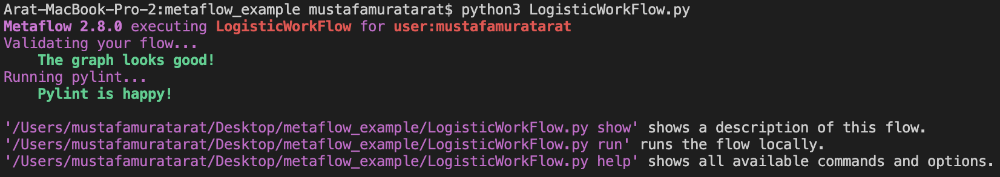

You can execute the Python as any Python script. First, try running the following:

```
python3 LogisticWorkFlow.py
```

This will validate the flow structure without executing any steps. Metaflow has a number of rules for what is considered a valid DAG.


